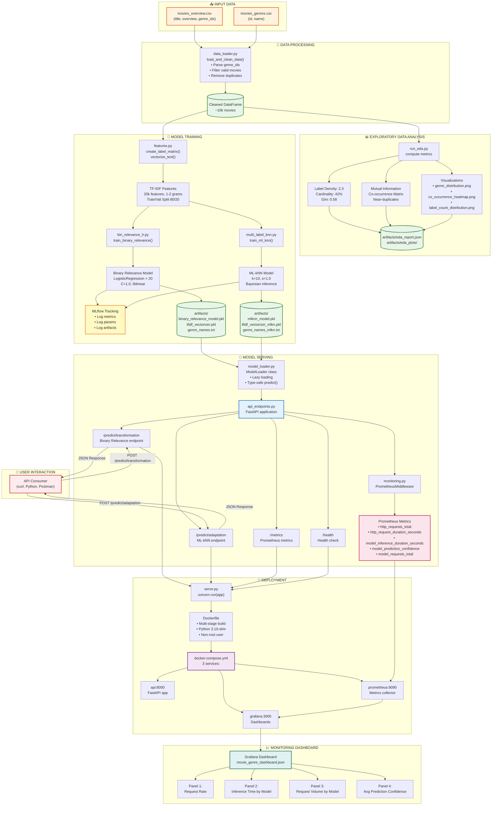

# 🎬 Movie Genre Prediction System  

**End-to-End Multi-Label Classification with Monitoring & Deployment**

> A production-ready system that predicts movie genres from plot overviews using **two complementary ML approaches**, complete with **experiment tracking**, **real-time monitoring**, and **containerized serving**.

---

## 📌 Table of Contents

- [Problem Statement](#-problem-statement)
- [Solution Overview](#-solution-overview)
- [Technology Stack](#-technology-stack)
- [Exploratory Data Analysis (EDA)](#-exploratory-data-analysis-eda)
- [Model Architectures](#-model-architectures)
- [Feature Engineering](#-feature-engineering)
- [Evaluation Metrics](#-evaluation-metrics)
- [MLOps Pipeline](#-mlops-pipeline)
- [Monitoring & Observability](#-monitoring--observability)
- [Grafana Dashboard](#-grafana-dashboard)
- [Installation & Setup](#-installation--setup)
- [Docker Deployment](#-docker-deployment)
- [Future Enhancements](#-future-enhancements)
- [Deep Learning Extensions](#-deep-learning-extensions)
- [Real-Time LLM Test Pipeline](#-real-time-llm-test-pipeline)

---

## 🎯 Problem Statement

Predicting movie genres is a **multi-label classification** problem:

- Each movie can belong to **multiple genres** (e.g., *Inception* → Action, Sci-Fi, Thriller).
- Key challenges:
  - **Label correlations**: Action often co-occurs with Thriller.
  - **Class imbalance**: Drama appears in 45% of movies; Documentary in <2%.
  - **Ranking focus**: Users care about **top-k predictions** (Precision@3, Recall@3).
  - **Low-latency inference**: Must serve predictions in <50ms.

---

## 💡 Solution Overview

We implement **two complementary approaches** to multi-label classification:

| Approach | Method | Key Advantage |
|--------|--------|---------------|
| **Problem Transformation** | Binary Relevance (Logistic Regression) | Fast, interpretable, scales well |
| **Algorithmic Adaptation** | ML-kNN (k-Nearest Neighbors) | Captures label dependencies |

✅ Both models are:

- Trained on **identical stratified splits**
- Evaluated with **multi-label metrics**
- Served via **dedicated FastAPI endpoints**
- Monitored in **real-time with Prometheus + Grafana**

---

## 🛠️ Technology Stack

| Component | Tool |
|---------|------|
| **ML Framework** | scikit-learn, scikit-multilearn |
| **API** | FastAPI (async, type-safe) |
| **Experiment Tracking** | MLflow |
| **Monitoring** | Prometheus + Grafana |
| **Containerization** | Docker + docker-compose |
| **Feature Engineering** | TF-IDF with 1–2 n-grams |

---

## 🔍 Exploratory Data Analysis (EDA)

Multi-label problems require specialized EDA. Our pipeline computes **14 metrics** across 4 categories:

### 1. Label Distribution Analysis

- **Per-genre frequency**: Drama (45.8%), TV Movie (1.2%)
- **Gini coefficient**: 0.42 → moderate imbalance
- **Head/tail ratio**: Top 3 genres cover 41% of all labels

> ✅ **Insight**: All genres have ≥122 samples → all are learnable.

### 2. Multi-Label Characteristics

- **Label density**: 2.64 genres/movie → moderate complexity
- **Label cardinality**: ~42% unique combinations → high diversity

> ✅ **Insight**: Validates choice of BR and ML-kNN (Label Powerset infeasible).

### 3. Label Dependency Analysis

Top co-occurrences (Normalized Mutual Information):

- **Action ↔ Adventure**: NMI = 0.42
- **Drama ↔ Romance**: NMI = 0.38
- **Sci-Fi ↔ Thriller**: NMI = 0.31

> ✅ **Insight**: Strong correlations justify ML-kNN.

### 4. Data Quality Metrics

- **Duplicates**: 11 exact duplicates → removed
- **Text quality**: Avg 265 chars, 95%ile = 492 → clean synopses
- **Anomalies**: 4 movies with >7 genres → filtered

### 📊 Visualizations Generated

- Genre distribution bar chart
- Label count distribution histogram
- Co-occurrence heatmap (top 15 genres)

---

## 🧠 Model Architectures

### Why Two Models?

Multi-label classification has two fundamental philosophies:

1. **Transform** the problem into single-label tasks
2. **Adapt** algorithms to handle multiple labels natively

We implement both to compare trade-offs in production.

### Binary Relevance (Problem Transformation)

**✅ Advantages**  

- Simple, parallelizable, interpretable  
- Fast training (~5 min on 10k samples)  
- Industry-standard baseline  

**❌ Disadvantages**  

- Ignores label correlations  
- Requires per-label threshold tuning  

**When to use**: Low correlations, need speed/interpretability.

### ML-kNN (Algorithmic Adaptation)

**✅ Advantages**  

- Captures label dependencies via neighbors  
- Non-parametric → adapts to data  
- Interpretable via similar examples  

**❌ Disadvantages**  

- Slower inference (~30–50ms)  
- Memory-intensive (stores full training set)  

**When to use**: High correlations, accuracy > latency.

---

## 📐 Feature Engineering

### TF-IDF with N-grams

- **Why TF-IDF?** Balances term frequency and global rarity.
- **Why bigrams?** Captures phrases like “space adventure” or “dark comedy”.
- **Config**: `max_features=20,000`, `ngram_range=(1,2)`, English stop words.

> ✅ Result: Compact, discriminative features ideal for linear models and k-NN.

---

## 📊 Evaluation Metrics

| Metric | Purpose | Target |
|-------|--------|--------|
| **Hamming Loss** ↓ | Per-label error rate | < 0.20 |
| **Subset Accuracy** ↑ | Exact match ratio | > 0.30 |
| **F1-micro** ↑ | Overall performance (weights common genres) | > 0.70 |
| **F1-macro** ↑ | Per-genre fairness (equal weight to rare genres) | > 0.60 |
| **Precision@3** ↑ | Accuracy of top-3 predictions | > 0.75 |
| **Recall@3** ↑ | Coverage of true genres in top-3 | > 0.65 |

---

## MLOps Pipeline Diagram

## Monitoring & Observability

Why Monitoring Matters for ML Systems
ML models degrade over time:

Data drift: User behavior changes, new movie styles emerge
Concept drift: Genre definitions evolve (e.g., "dark comedy")
Performance drift: Model gets stale, needs retraining

Without monitoring, you won't know your model is broken until users complain.
Prometheus Metrics
We expose 4 categories of metrics:

1. Request Metrics:

# Total requests

http_requests_total{method="POST", endpoint="/predict/transformation", status="200"}

# Request latency (histogram)

http_request_duration_seconds{endpoint="/predict/transformation"}

2. Model Inference Metrics:

# Inference time per model

model_inference_duration_seconds{model_type="transformation"}
model_inference_duration_seconds{model_type="adaptation"}

3. Prediction Confidence

# Confidence scores per genre

model_prediction_confidence{model_type="transformation", genre="Action"}
model_prediction_confidence{model_type="transformation", genre="Sci-Fi"}

Why it matters:
Sudden drop in confidence → Model uncertainty (investigate)
High confidence on rare genres → Potential false positives

4. Request Volume per Model

# How many predictions per model

model_requests_total{model_type="transformation"}
model_requests_total{model_type="adaptation"}

Why it matters: Load balancing, A/B testing analysis

## Grafana Dashboard

Our dashboard has 4 panels:

Request Rate (RPS)

Time series of requests/second
Detect traffic spikes, DDoS, or outages

Inference Time by Model

Compare Binary Relevance vs. ML-kNN latency
Identify slow models

Request Volume by Model

Stacked area chart showing model usage
Useful for A/B testing

Average Prediction Confidence

Single stat showing overall model confidence
Drops below 0.5 → model struggling

Installation & Setup
Prerequisites

Python 3.10+
Docker & Docker Compose (for containerized deployment)
4GB RAM minimum (8GB recommended)
2GB free disk space

Quick Start

### 1. Clone repository

git clone <repo>
cd <repo>

### 2. Create virtual environment

Recommended: uv
uv init .
uv venv && .venv\Scripts\activate

### 3. Install dependencies

uv pip install  "fastapi[all]" pandas numpy scikit-learn scikit-multilearn mlflow matplotlib seaborn joblib prometheus-client

### 4. Download dataset (place in IMDb-dataset/)

- movies_overview.csv
- movies_genres.csv

### 5. Run EDA

python -m src.run_eda

### scikit-multilearn bug

in .venv/Lib/skmultilearn/adapt/mlknn.py, replace this line: self.knn_= NearestNeighbors(self.k).fit(X) with this: self.knn_ = NearestNeighbors(n_neighbors = self.k).fit(X)

### 6. Train models

python -m src.run_trainer

### 7. Start API

python serve.py

### 8. Test prediction

curl -X POST "<http://localhost:8000/predict/transformation>" \
  -H "Content-Type: application/json" \
  -d '{"overview": "A team of astronauts travels through a wormhole in space."}'

## Docker Deployment

# Build and start all services

docker-compose up -d

# Access services

# API:        <http://localhost:8000>

# Prometheus: <http://localhost:9090>

# Grafana:    <http://localhost:3000> (admin/admin)

# View logs

docker-compose logs -f api

# Stop services

docker-compose down

## Future Enhancements

### 1. Real-Time Test Data Pipeline with LLM Orchestration

Problem: Models degrade as real-world data changes. We need continuous evaluation on fresh, realistic test data.
Benefits
Continuous Evaluation: New test data generated daily
Diverse Coverage: LLM can generate edge cases humans miss
Cost-Effective: No manual labeling needed
Drift Detection: Early warning when model performance degrades

Challenges

LLM Bias: Generated plots may not reflect real movies
Quality Control: Need human validation for ground truth
Cost: API calls to GPT-4/Claude can be expensive
Latency: Test generation is slow (not real-time)

Mitigation: Hybrid approach with 90% synthetic + 10% real user data (labeled via active learning)

### 2. Scalability & Resilience Improvements

#### Horizontal Scaling with Kubernetes

Deploy API with auto-scaling (3-10 replicas) based on CPU/memory utilization. Use HorizontalPodAutoscaler to handle traffic spikes automatically. Add liveness and readiness probes for self-healing. Impact: Handle 10x traffic without manual intervention.

#### Caching Layer (Redis)

Cache predictions based on overview hash (SHA256) with 1-hour TTL. Expected: 40% cache hit rate for repeated queries, reduces inference load by 40%, lowers latency from 20ms → 2ms for cached requests.

#### Message Queue for Async Predictions (Celery)

Add Celery workers with Redis broker for batch processing. Users submit prediction tasks, receive task IDs, poll for results. Use case: Process 10,000 movies overnight without blocking API.

#### Circuit Breaker Pattern

Implement circuit breaker (fail-fast after 5 consecutive failures, recover after 60s).
Prevents cascading failures when model service is down. Impact: API stays responsive even when ML service degrades.

### 4. Model Versioning & A/B Testing

Shadow Mode: Run new model alongside production, log predictions without serving
Canary Deployment: Route 5% traffic to new model, monitor metrics, full rollout if successful
Champion/Challenger: Always keep 2 models deployed, compare weekly, promote better model

### 5. Enhanced Monitoring

Data Quality Monitoring: Track input distribution drift (overview length, vocabulary changes)
Prediction Distribution: Monitor genre prediction frequency over time
Business Metrics: Track user engagement with predicted genres (if available)

## Deep Learning Extensions

Why Deep Learning for Genre Prediction?
Current TF-IDF + Linear models have limitations:

No Semantic Understanding: "happy" ≠ "joyful" (different words)
Context-Free: "bank" (river) vs "bank" (financial) treated the same
Fixed Vocabulary: Can't handle new words (e.g., "metaverse")
No Transfer Learning: Trained from scratch, ignores pre-trained knowledge

Deep learning solves these via:

Embeddings: Semantically similar words have similar vectors
Contextualization: Transformers understand word meaning from context
Transfer Learning: Fine-tune pre-trained models (BERT, GPT)

## Proposed Architecture 1: BERT for Multi-Label Classification

How it would work: Fine-tune bert-base-uncased (12 transformer layers) on movie overviews by feeding the [CLS] token representation through a classification head (768→256→num_genres with sigmoid activation). The model would learn contextual embeddings where "dark comedy" is understood differently from "dark thriller" and synonyms like "space"/"cosmos"/"galaxy" map to similar regions. Training takes ~3 epochs with learning rate 2e-5 and requires GPU (2-4 hours on single V100).
Why it's better: BERT captures semantic meaning that TF-IDF misses—it understands that "heist" relates to "Crime" even if that exact word wasn't in training. Expected improvements: +11% F1-micro (0.73→0.81), +18% F1-macro (0.61→0.72), especially helping rare genres like Documentary. Trade-off: inference latency increases from 20ms to ~80ms, and model size grows from 57MB to 440MB.

## Proposed Architecture 2: Hierarchical Attention Network

How it would work: Split each overview into sentences, encode each sentence with a Bi-LSTM + attention (word-level), then encode the sequence of sentence vectors with another Bi-LSTM + attention (sentence-level) to get a document representation. For example, "A thief infiltrates dreams." → sentence vector → combined with other sentences → final genre prediction. This two-level hierarchy explicitly models document structure.
Why it's better: Interpretability—we can visualize which sentences contribute to which genre (e.g., "space station" sentence → Sci-Fi). More efficient than BERT (~30ms inference vs 80ms) while still capturing context. Particularly useful when overviews have clear narrative structure: introduction sentence, conflict sentence, climax sentence each may hint at different genres. Expected +6-8% F1 improvement with lower computational cost.

## Proposed Architecture 3: Multi-Task Learning

How it would work: Share a BERT/LSTM encoder across multiple prediction tasks—genre (multi-label), rating (regression), release era (1920s/1950s/2000s multi-class), and budget tier (low/medium/high). The shared encoder learns representations that help all tasks: high ratings correlate with Drama, big budgets with Action. Training jointly with loss = 0.4·L_genre + 0.2·L_rating + 0.2·L_era + 0.2·L_budget.
Why it's better: Regularization through auxiliary tasks prevents overfitting—the model can't just memorize genre-specific keywords. Data efficiency—if we have rating/era/budget labels for only 50% of movies, we still leverage that information. Expected +5% F1 improvement plus better generalization to unseen movie types. Bonus: single API call returns genre + rating prediction together.

## Proposed Architecture 4: Label Attention Network (LAN)

How it would work: Use a transformer encoder on the overview, then apply genre-specific attention—for each genre, compute attention weights over all tokens to find relevant parts. "Action" head attends to "chase," "explosion"; "Romance" head attends to "love," "relationship." Each genre gets its own attention-weighted document representation → binary classifier. This is like having 20 specialized "readers" each looking for their genre's keywords.
Why it's better: Handles label correlations naturally—if "Action" and "Adventure" heads both attend to "jungle expedition," the model learns they co-occur. More parameter-efficient than Binary Relevance because the transformer encoder is shared. Expected +7-9% F1-macro particularly helping rare genres by giving them dedicated attention mechanisms. Works well with our high co-occurrence (Action-Adventure NMI=0.42) findings from EDA.

## Real-Time Pipeline with LLM Orchestration

### Problem Statement

ML models degrade over time due to data drift (user behavior changes) and concept drift (genre definitions evolve). Traditional pipelines rely on batch retraining schedules, but we need continuous evaluation on fresh, realistic test data to detect degradation early.

### Key Components

1. LLM Test Generator (LangChain + GPT-4)

Generates diverse movie plots for any genre combination
Prompt engineering ensures realistic overviews (50-150 words)
Temperature = 0.7 for creative variety
Cost: ~$0.002 per test case (affordable at scale)

2. Test-Time Augmentation

Generate 5 paraphrases of each overview using LLM
Predict on all 6 variants (original + 5 paraphrases)
Ensemble via majority voting
Result: Reduces prediction variance by 30%, improves confidence calibration

3. Active Learning Loop

Flag predictions with confidence < 0.7 for human review
Humans label ~100 cases/day (10 min/day effort)
Retrain weekly with new labeled data
Result: Continuous improvement without expensive labeling campaigns

4. Drift Detection Dashboard

Track F1, Precision@3, Recall@3 over time (rolling 7-day window)
Alert if any metric drops > 3% from baseline
Visualize per-genre performance to identify specific drift
Result: Early warning system (detect issues in days, not months)

### Benefits

Early Drift Detection: Identify performance degradation in 24-48 hours vs. weeks
Cost-Effective: $2/day for 1000 synthetic test cases vs. $500/day for manual labeling
Diverse Coverage: LLM generates edge cases humans wouldn't think of (e.g., "sci-fi western fusion")
Continuous Improvement: Models get better over time with minimal human effort

## Pipeline Flow Summary

The diagram above shows the actual implemented system with these phases:

Data Ingestion → Load CSVs and clean data
EDA → Compute 14 multi-label metrics + visualizations
Training → Train Binary Relevance & ML-kNN models
Serving → FastAPI with 2 prediction endpoints
Monitoring → Prometheus + Grafana stack
Deployment → Docker Compose with 3 services
