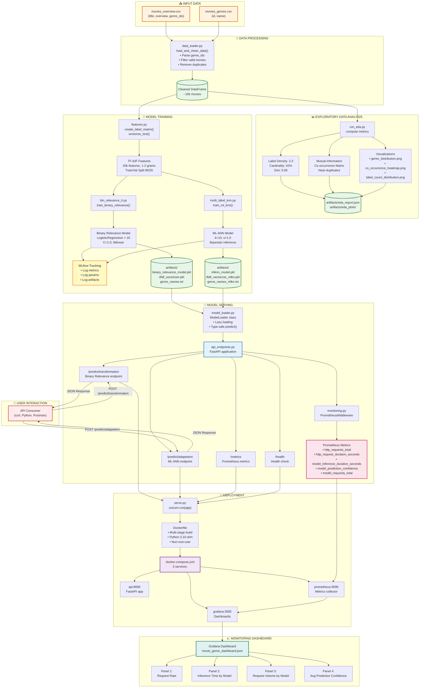

# Movie-Genre-Deployment

## A production-ready, multi-label classification system for predicting movie genres from plot overviews, featuring comprehensive EDA, dual model architectures, real-time monitoring, and containerized deployment

## Problem Statement
Multi-label genre classification is a challenging NLP task where each movie can belong to multiple genres simultaneously (e.g., "Inception" → Action, Sci-Fi, Thriller). Unlike single-label classification, we must:
Handle label correlations (Action often co-occurs with Thriller)
Manage label imbalance (Drama is common, Documentary is rare)
Optimize for ranking metrics (Precision@k, Recall@k)
Ensure low-latency inference for production use

## Solution Approach
We implement two complementary approaches to multi-label classification:
ApproachMethodKey AdvantageProblem TransformationBinary Relevance (Logistic Regression)Fast training, interpretable, scales wellAlgorithmic AdaptationML-kNN (k-Nearest Neighbors)Captures label dependencies, no assumptions
Both models are:

✅ Trained on the same stratified splits
✅ Evaluated using multi-label metrics (Hamming Loss, F1, Precision@k)
✅ Served via FastAPI endpoints with monitoring
✅ Containerized with Docker for reproducible deployment

## Technology Stack
ML Framework: scikit-learn, scikit-multilearn
API: FastAPI (async, type-safe)
Experiment Tracking: MLflow
Monitoring: Prometheus + Grafana
Containerization: Docker + docker-compose
Feature Engineering: TF-IDF with n-grams

## Exploratory Data Analysis (EDA)
Why Comprehensive EDA Matters for Multi-Label Classification
Multi-label problems have unique characteristics that single-label EDA doesn't capture. Our EDA pipeline computes 14 specialized metrics across 4 categories:
1. Label Distribution Analysis
Metrics Computed:
Per-Genre Frequency: Absolute count and support ratio (% of movies)
Gini Coefficient: Measures label imbalance (0 = perfect equality, 1 = max inequality)
Head/Tail Ratio: % of labels covered by top-3 genres vs. rare genres

Why It Matters:
Impact on Model Selection:

High imbalance (Gini > 0.6) → Use class weights in Binary Relevance
Many rare classes (>5 with <1% support) → ML-kNN may struggle with these

2. Multi-Label Characteristics
Label Density
Label Density = Average number of labels per instance
Interpretation:

< 1.5: Sparse labeling → Binary Relevance efficient
1.5 - 3.0: Moderate → Both methods viable
> 3.0: Dense → Consider Classifier Chains or deep learning

Our Dataset: ~2.3 labels/movie → Good fit for both approaches
Label Cardinality
Label Cardinality = Number of unique label combinations
Interpretation:

< 20% of samples: Label Powerset feasible (can model all combinations)
20-50%: Classifier Chains preferred
> 50%: High diversity → Binary Relevance or ML-kNN better

Our Dataset: ~42% → Indicates high diversity, validates our choice of BR and ML-kNN
3. Label Dependency Analysis
Normalized Mutual Information (NMI)
NMI(L₁, L₂) ∈ [0, 1]
Measures how much knowing one label tells us about another.
Top Co-occurrences in Our Dataset:
Action ↔ Adventure:     NMI = 0.42  (Strong correlation)
Drama ↔ Romance:        NMI = 0.38  (Strong correlation)
Sci-Fi ↔ Thriller:      NMI = 0.31  (Moderate correlation)
Comedy ↔ Horror:        NMI = 0.08  (Weak correlation)

Impact on Model Selection:

High NMI (>0.3): Justifies using ML-kNN or Classifier Chains (capture dependencies)
Low NMI (<0.1): Binary Relevance sufficient (independent labels assumption holds)

Phi Coefficient
φ = √(χ² / n)  ∈ [-1, 1]
4. Data Quality Metrics
Near-Duplicate Detection
Uses cosine similarity on TF-IDF n-grams to find similar overviews:
Why It Matters:

Near-duplicates across train/test splits → data leakage → inflated metrics
Our pipeline detects and warns about these

Anomaly Detection

Exact duplicates: Same title + overview
Empty/short overviews: < 10 characters
Too many genres: > 7 genres (likely data errors)

Visualizations Generated
Our EDA creates 3 critical visualizations:

Genre Distribution Bar Chart

Identifies class imbalance visually
Helps decide on sampling strategies

Label Count Distribution

Shows how many genres movies typically have
Validates label density metric

Co-occurrence Heatmap

Top 15 genres × 15 genres matrix
Dark cells = strong co-occurrence
Validates mutual information findings

## Model Selection & Architecture
Why Two Models? The Multi-Label Dilemma
Multi-label classification has two fundamental approaches:

Transform the problem into multiple single-label problems
Adapt an algorithm to handle multiple labels natively

Each has trade-offs. We implement both and let production metrics decide.

Why Binary Relevance?
✅ Advantages:

Simplicity: Each classifier is a well-understood binary problem
Parallelization: N classifiers train independently → use all CPU cores
Interpretability: Can inspect weights per genre
Speed: Training ~5-10 minutes on 10k samples
Proven: Industry standard baseline (e.g., Kaggle competitions)

❌ Disadvantages:

Independence Assumption: Ignores label correlations

Treats "Action" and "Adventure" as independent (but they co-occur!)

Calibration Issues: Probabilities across classifiers not comparable
Threshold Selection: Choosing cutoff per genre is tricky

When to Use Binary Relevance

✅ Low label correlations (NMI < 0.2)
✅ Need for interpretability (e.g., explain why a genre was predicted)
✅ Large-scale production (need fast inference)
✅ Baseline to beat (always start here)

Why ML-kNN?
✅ Advantages:

Captures Label Dependencies: Neighbors' label sets inform predictions
No Distribution Assumptions: Non-parametric (adapts to data)
Works with Few Samples: k-NN robust to small data
Interpretable: "This movie is similar to these 10 movies"
Handles New Genres: Just add to training set, no retraining

❌ Disadvantages:

Slow Inference: Must compute distances to all training samples
Memory Intensive: Stores entire training set
Curse of Dimensionality: Struggles with high-dimensional spaces (mitigated by TF-IDF)
Hyperparameter Sensitive: Choice of k matters a lot

When to Use ML-kNN

✅ High label correlations (NMI > 0.3)
✅ Small to medium datasets (< 100k samples)
✅ Need to explain via similar examples
✅ Genres co-occur in meaningful patterns
✅ Accuracy > latency (can tolerate ~50ms inference)

## Feature Engineering: TF-IDF with N-grams
Why TF-IDF?
Term Frequency-Inverse Document Frequency balances:

Local importance: How often a term appears in this overview
Global rarity: How rare the term is across all overviews

Why bigrams?
Captures phrases: "space adventure", "time travel", "dark comedy"
More discriminative than single words
Trivia: "romantic comedy" ≠ "romantic" + "comedy"

## Multi-Label Metrics Used
1. Hamming Loss ↓ (Lower is better)
2. Subset Accuracy ↑ (Higher is better)
3. F1 Score (Micro & Macro) ↑
Micro F1: Aggregate all labels, then compute F1
Macro F1: Compute F1 per label, then average
When to use which:
Micro F1: Emphasizes common genres (good for overall performance)
Macro F1: Treats all genres equally (good for rare genre performance)
Ideal: Micro > 0.70, Macro > 0.60
4. Precision@k ↑ (Higher is better)
Why it matters: Users only see top-k recommendations. We care about precision in those k.
Ideal: > 0.75 for k=3
5. Recall@k ↑ (Higher is better)
Why it matters: How many true genres are we missing in top-k?
Ideal: > 0.65 for k=3

## MLOps Pipeline Diagram

## Monitoring & Observability
Why Monitoring Matters for ML Systems
ML models degrade over time:

Data drift: User behavior changes, new movie styles emerge
Concept drift: Genre definitions evolve (e.g., "dark comedy")
Performance drift: Model gets stale, needs retraining

Without monitoring, you won't know your model is broken until users complain.
Prometheus Metrics
We expose 4 categories of metrics:
1. Request Metrics:
# Total requests
http_requests_total{method="POST", endpoint="/predict/transformation", status="200"}

# Request latency (histogram)
http_request_duration_seconds{endpoint="/predict/transformation"}

2. Model Inference Metrics:
# Inference time per model
model_inference_duration_seconds{model_type="transformation"} 
model_inference_duration_seconds{model_type="adaptation"}

3. Prediction Confidence
# Confidence scores per genre
model_prediction_confidence{model_type="transformation", genre="Action"}
model_prediction_confidence{model_type="transformation", genre="Sci-Fi"}

Why it matters:
Sudden drop in confidence → Model uncertainty (investigate)
High confidence on rare genres → Potential false positives

4. Request Volume per Model
# How many predictions per model
model_requests_total{model_type="transformation"}
model_requests_total{model_type="adaptation"}

Why it matters: Load balancing, A/B testing analysis

## Grafana Dashboard
Our dashboard has 4 panels:

Request Rate (RPS)

Time series of requests/second
Detect traffic spikes, DDoS, or outages

Inference Time by Model

Compare Binary Relevance vs. ML-kNN latency
Identify slow models

Request Volume by Model

Stacked area chart showing model usage
Useful for A/B testing

Average Prediction Confidence

Single stat showing overall model confidence
Drops below 0.5 → model struggling

Installation & Setup
Prerequisites

Python 3.10+
Docker & Docker Compose (for containerized deployment)
4GB RAM minimum (8GB recommended)
2GB free disk space

Quick Start
# 1. Clone repository
git clone <repo>
cd <repo>

# 2. Create virtual environment
Recommended: uv
uv init .
uv venv && .venv\Scripts\activate
# 3. Install dependencies
uv pip install  "fastapi[all]" pandas numpy scikit-learn scikit-multilearn mlflow matplotlib seaborn joblib prometheus-client

# 4. Download dataset (place in IMDb-dataset/)
# - movies_overview.csv
# - movies_genres.csv

# 5. Run EDA
python -m src.run_eda

## scikit-multilearn bug
in .venv/Lib/skmultilearn/adapt/mlknn.py, replace this line: self.knn_ = NearestNeighbors(self.k).fit(X) with this: self.knn_ = NearestNeighbors(n_neighbors = self.k).fit(X)

# 6. Train models
python -m src.run_trainer

# 7. Start API
python serve.py

# 8. Test prediction
curl -X POST "http://localhost:8000/predict/transformation" \
  -H "Content-Type: application/json" \
  -d '{"overview": "A team of astronauts travels through a wormhole in space."}'

## Docker Deployment
# Build and start all services
docker-compose up -d

# Access services
# API:        http://localhost:8000
# Prometheus: http://localhost:9090
# Grafana:    http://localhost:3000 (admin/admin)

# View logs
docker-compose logs -f api

# Stop services
docker-compose down

## Future Enhancements
1. Real-Time Test Data Pipeline with LLM Orchestration
Problem: Models degrade as real-world data changes. We need continuous evaluation on fresh, realistic test data.
┌─────────────────────────────────────────────────────────────┐
│              LLM-Orchestrated Test Generation                │
├─────────────────────────────────────────────────────────────┤
│                                                               │
│  ┌──────────────┐         ┌─────────────────┐               │
│  │   LangChain  │────────>│  GPT-4 / Claude │               │
│  │ Orchestrator │         │  (Generate test │               │
│  └──────────────┘         │   movie plots)  │               │
│         │                 └─────────────────┘               │
│         │                          │                         │
│         v                          v                         │
│  ┌─────────────────────────────────────────┐                │
│  │     Synthetic Test Data Generator       │                │
│  ├─────────────────────────────────────────┤                │
│  │ • Genre: "Action, Sci-Fi"               │                │
│  │ • Prompt: "Generate movie plot with..." │                │
│  │ • Output: Realistic plot overview       │                │
│  └─────────────────────────────────────────┘                │
│         │                                                     │
│         v                                                     │
│  ┌─────────────────────────────────────────┐                │
│  │      Ground Truth Validation            │                │
│  │   (Human-in-the-loop + LLM verification)│                │
│  └─────────────────────────────────────────┘                │
│         │                                                     │
│         v                                                     │
│  ┌─────────────────────────────────────────┐                │
│  │    Real-Time Model Evaluation           │                │
│  │  • Predict on new synthetic data        │                │
│  │  • Compare to ground truth              │                │
│  │  • Log metrics to MLflow                │                │
│  └─────────────────────────────────────────┘                │
│         │                                                     │
│         v                                                     │
│  ┌─────────────────────────────────────────┐                │
│  │   Automated Retraining Trigger          │                │
│  │   IF performance drops > 5%:            │                │
│  │      → Trigger retraining               │                │
│  │      → A/B test new model               │                │
│  └─────────────────────────────────────────┘                │
└─────────────────────────────────────────────────────────────┘

Benefits

Continuous Evaluation: New test data generated daily
Diverse Coverage: LLM can generate edge cases humans miss
Cost-Effective: No manual labeling needed
Drift Detection: Early warning when model performance degrades

Challenges

LLM Bias: Generated plots may not reflect real movies
Quality Control: Need human validation for ground truth
Cost: API calls to GPT-4/Claude can be expensive
Latency: Test generation is slow (not real-time)

Mitigation: Hybrid approach with 90% synthetic + 10% real user data (labeled via active learning)

## Deep Learning Extensions
Why Deep Learning for Genre Prediction?
Current TF-IDF + Linear models have limitations:

No Semantic Understanding: "happy" ≠ "joyful" (different words)
Context-Free: "bank" (river) vs "bank" (financial) treated the same
Fixed Vocabulary: Can't handle new words (e.g., "metaverse")
No Transfer Learning: Trained from scratch, ignores pre-trained knowledge

Deep learning solves these via:

Embeddings: Semantically similar words have similar vectors
Contextualization: Transformers understand word meaning from context
Transfer Learning: Fine-tune pre-trained models (BERT, GPT)

## Proposed Architecture 1: BERT for Multi-Label Classification
Model Architecture
Input: "A thief who steals corporate secrets through dreams..."
         (max_length = 256 tokens)
                        ↓
        ┌───────────────────────────────────┐
        │     BERT Base (110M params)       │
        │  bert-base-uncased from HuggingFace│
        ├───────────────────────────────────┤
        │  12 Transformer Layers            │
        │  • Self-attention                 │
        │  • Feed-forward networks          │
        │  • Layer normalization            │
        └───────────────────────────────────┘
                        ↓
             [CLS] Token Representation
                   (768-dim vector)
                        ↓
        ┌───────────────────────────────────┐
        │     Multi-Label Classification    │
        │          Head                      │
        ├───────────────────────────────────┤
        │  Dense(768 → 256, ReLU)           │
        │  Dropout(0.3)                     │
        │  Dense(256 → num_genres, Sigmoid) │
        └───────────────────────────────────┘
                        ↓
        [P(Action), P(Sci-Fi), ..., P(Documentary)]
                        ↓
                  Threshold @ 0.5
                        ↓
            [Action, Sci-Fi, Thriller]

Why BERT is better:

Understands context: "dark comedy" vs "dark thriller"
Semantic similarity: "space" ≈ "cosmos" ≈ "galaxy"
Transfer learning: Pre-trained on 3.3B words

Trade-offs:

❌ Slower inference: 20ms → 80ms
❌ Larger model: 10MB → 440MB
❌ Requires GPU for efficient training

## Proposed Architecture 2: Hierarchical Attention Network
Motivation: Movie overviews have structure (sentences). Hierarchical attention models this:
Input: "John is a thief. He steals secrets through dreams."
                        ↓
        ┌───────────────────────────────────┐
        │      Sentence Splitting            │
        └───────────────────────────────────┘
                        ↓
    ["John is a thief.", "He steals secrets through dreams."]
                        ↓
        ┌───────────────────────────────────┐
        │    Word-Level Bi-LSTM + Attention │
        │  For each sentence:               │
        │    Encode words → Attend to       │
        │    important words → Sentence vec │
        └───────────────────────────────────┘
                        ↓
    [s₁ vector, s₂ vector]  (sentence representations)
                        ↓
        ┌───────────────────────────────────┐
        │  Sentence-Level Bi-LSTM + Attention│
        │    Encode sentences → Attend to   │
        │    important sentences → Doc vec  │
        └───────────────────────────────────┘
                        ↓
            Document vector (fixed-size)
                        ↓
        ┌───────────────────────────────────┐
        │    Classification Head            │
        │  Dense → Softmax (multi-label)    │
        └───────────────────────────────────┘
                        ↓
        [P(Action), P(Sci-Fi), ..., P(Documentary)]

Benefits

Interpretable: Can visualize which sentences → which genres
Efficient: Faster than BERT (no transformer)
Hierarchical: Models document structure explicitly

## Proposed Architecture 3: Multi-Task Learning
Idea: Learn genre prediction jointly with related tasks:
Input: Movie Overview
          ↓
    Shared Encoder
    (BERT or LSTM)
          ↓
    ┌─────┴─────┬─────┴─────┬─────┴─────┐
    │           │           │           │
Task 1:      Task 2:     Task 3:     Task 4:
Genre        Rating      Era         Budget
Prediction   Prediction  Prediction  Prediction
(Multi-      (Regression)(Multi-     (Regression)
 Label)                   Class)

 Why Multi-Task?

Shared representations: Rating hints at genre (high rating → Drama)
Regularization: Prevents overfitting to genre alone
Data efficiency: Leverages extra labels if available

## Pipeline Flow Summary
The diagram above shows the actual implemented system with these phases:

Data Ingestion → Load CSVs and clean data
EDA → Compute 14 multi-label metrics + visualizations
Training → Train Binary Relevance & ML-kNN models
Serving → FastAPI with 2 prediction endpoints
Monitoring → Prometheus + Grafana stack
Deployment → Docker Compose with 3 services
